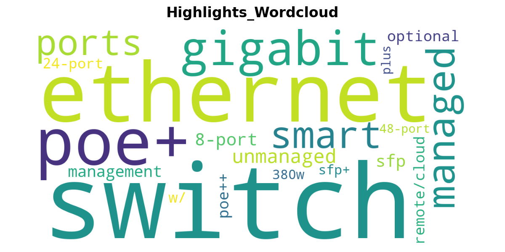

# NETGEAR Switch Product Scraper

## Overview
This project scrapes product information from the NETGEAR website, focusing on their switch products. The scraped data is analyzed to identify keyword frequency, helping to understand common terms used in product highlighs and descriptions.

## Features
- Scrapes product names, descriptions, and other relevant details.
- Analyzes the frequency of keywords in the product descriptions.
- Excludes common stop words to focus on meaningful terms.

## Output
The scraped data will be saved in CSV files. Wordclouds will also be created to better visualize the keyword frequency.

